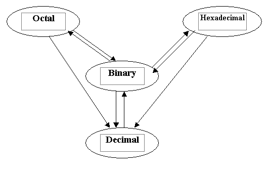

# KIẾN TRÚC MÁY TÍNH VÀ HỢP NGỮ
Mục lục

[1. Hệ thống số đếm](#hethongsodem)

[2. Đại số Boole - Cổng Logic](#daisoboole)

-------------------------------------------

# Chương 1. Hệ thống số đếm 
## Biểu diễn số.
- Hệ thống số đếm là tập hợp những ký tự và quan hệ giữa chúng để biểu diễn số.
- Có 2 loại hệ thống số đếm:
    1. Loại không có vị trí.
    2. Loại có vị trí (có trọng số):
        - Cơ số (radix): $r$
        - Các chữ số (digits): $d$ có giá trị $0,1,2,3,\dots,r-1$
        - Trọng số (weight) ở vị trí $i$: $w_i=r^i$

- Các biểu diễn:
    - Với $r$ là cơ số.
    - Phần nguyên: 
    $$\overline{d_nd_{n-1}\dots d_1d_0}_r = \sum\limits^n_{0}d_ir^i = d_nr^n +d_{n-1}r^{n-1} +\dots+d_1r+d_0$$

    - Phần thập phân: 
    $$\overline{0.d_1d_2\dots d_{m-1}d_m}_r = \sum\limits^m_1{d_ir^{-i}} = d_1r^{-1} + d_2r^{-2} + \dots +d_mr^{-m}$$

#### Ví dụ: 
$$1263.456_{10} = 1.10^3 + 2.10^2+ 6.10^1+3.10^0 + 4.10^{-1} + 5.10^{-2}+6.10^{-3}$$ 

## Các hệ thống số đếm
- **Hệ nhị phân (binary)**:
    - Cơ số (r): 2
    - Các chữ số (d): 0,1
    - Mỗi chữ số 1 bit
    - Nếu có $k$ bit thì sẽ có $2^k$ giá trị
    - Số nguyên $k$ bit (không dấu) có tầm trị là : $0 … 2^k -1$
    - Số bit cần biểu diễn số nguyên n: ${\lfloor \log_{2}{k}\rfloor +1}$
    - Có thể thêm ký tự B ( hoặc b) ở cuối để phân biệt.
    - Số nhị phân lẻ có $LSB = 1$
    - Số nhị phân chẵn $LSB = 0$ 
> Kí hiệu $\lfloor x\rfloor$ là $\max \,\{n\in \mathbb {Z} \mid n\leq x\}$ nói chung là làm tròn số $x$.
LSB (Least Significant Bit) là bit có trọng số nhỏ nhất.
MSB (Most Significant Bit) là bit có trong số lớn nhất.

#### Ví dụ
$$11011,1011_2=1.2^4+1.2^3+0.2^2+1.2^1 +1.2^0+1.2^{-1}+0.2^{-2}+1.2^{-3}+1.2^{-4} = 27.6875_{10}$$

Binary number|1|1|0|1|1|.|1|0|1|1|
|-|-|-|-|-|-|-|-|-|-|-|
weight|$2^4$|$2^3$|$2^2$|$2^{1}$|$2^0$|.|$2^{-1}$|$2^{-2}$|$2^{-3}$|$2^{-4}$|
result|16|8|0|2|1|.|0.5|0|0.125|0.0625

- **Hệ thập phân (decimal)**
    - Cơ số $r=10$
    - Các chử số $d$: $[0,1,2,3,4,5,6,7,8,9]$
    - Có thể thêm ký tự D ( hoặc d) ở cuối.

- **Hệ bát phân (octal)**
    - Cơ số $r = 8$.
    - Các chữ số d: $[0, 1, 2, 3, 4, 5, 6, 7]$.
    - Có thể thêm ký tự O ( hoặc o) ở cuối.

- **Thập lục phân (hexadecimal)**
    - Cơ số $r = 16$.
    - Các chữ số $d$: $[0, 1, 2, 3, 4, 5, 6, 7, 8, 9, A, B, C, D, E, F]$
    - Có thể thêm ký tự H ( hoặc h) ở cuối.

#### Ví dụ
$$ 3C7A,6E05 = $$

Binary number|3     |c    |7    |A      |.|6       |E       |0       |5       |
|------------|------|-----|-----|-------|-|--------|--------|--------|--------|
weight       |$16^3$|$16^2$|$16^1$|$16^0$|.|$16^{-1}$|$16^{-2}$|$16^{-3}$|$16^{-4}$|
result       |12288 |3072  |112   |10    |.|0.375    |0.0546875|0   |0.000076293

## Chuẩn IEEE 754/85 - chuẩn mã hóa số dấu chấm động
- Cơ số r=2 $\Rightarrow$ hệ nhị phân (Binary);
- Có các dạng cơ bản:
    1. Dạng có độ chính xác đơn (32b): `1b s|8b e|23b m`;
    2. Dạng có độ chính xác kép (64b): `1b s|11b e|52b m`;
    3. Dạng có độ chính xác kép mở rộng (80b): `1b s|15b e|64b m`;
> Trong đó, **$s$** là bit dấu (sign), **$e$** là bit mã lệch (excess) của phần mũ **$E$** (Exponent), **$m$** là bit phần lẻ của phần định trị **$M$**.

- Cách xác định:
    1. bit dấu: 
        - 0 $\Rightarrow$ số dương; 
        - 1 $\Rightarrow$ số âm;
    2. mã lệch $e$ của phần mũ $E$:  **$E = e - b$**
        Trong đó, **$b$** là độ lệch (bias):
        - Dạng 32b: $b=127$, hay $E=e-127$
        - Dạng 64b: $b=1023$, hay $E=e-1023$
        - Dạng 80b: $b=16383$, hay $E=e-16383$
    3. phần lẻ $m$ của phần định trị $M$: **$M=1.m$** (cũng là **$1,m$**)

- Công thức xác định giá trị của số thực $X$ tương ứng là:
$$X=(-1)^s \times 1.m \times 2^{e-b}, \textrm{ với } \times \textrm{ là dấu nhân}$$

## Bài tập chương 1
1. Trong hệ số đếm cơ số $r$, phương trình $x^2-153x+m=0$ có 2 nghiệm $X_1=55$ và $X_2=54$. Xác định $r$ (hệ $dec$) và $m$ (hệ $r$).

#### Giải
Phương trình $x^2-153x+m=0$ có 2 nghiệm $X_1=55$ và $X_2=54$ Trong hệ số đếm cơ số $r$.

Theo Định lí Vi-ét: 

$X_1+X_2=\frac{-b}{a} \ \Rightarrow 54_r+55_r=153_r\textrm{(1)}$

$X_1X_2=\frac{c}{a}\Rightarrow 54_r55_r=m_r\textrm{(2)}$

$\textrm{(1)}\Rightarrow 5+ 5r+4+5r=3+5r+r^2$
$\Rightarrow r^2-5r-6=0$
$\Rightarrow r=6 \textrm{ hoặc } r=-1\textrm{(loại)}$

Vậy đây là hệ số đếm cơ số 6.

$\textrm{(2)}\Rightarrow 55_6.54_6=m_6$
$\Rightarrow (5+5.6)(4+5.6)=m$
$\Rightarrow m=1190$
$\Rightarrow m_6=5302_6$

2. Trong hệ số đếm cơ số $r$, phương trình $x^2+Sx+m=0$ có 2 nghiệm $X_1$ và $X_2$. Viết chương trình nhập vào $S, X_1 \textrm{ và } X_2$ (kiểu chuỗi), sau đó tính và xuất ra giá trị $r$ (hệ $dec$) và $m$ (hệ $r$).

3. Trong hệ số đếm cơ số $r$, phương trình $x^2-mx+P=0$ có 2 nghiệm $X_1$ và $X_2$. Viết chương trình nhập vào $P, X_1 \textrm{ và } X_2$ (kiểu chuỗi), sau đó tính và xuất ra giá trị $r$ (hệ $dec$) và $m$ (hệ $r$).

4. Cho số thực $z$ kiểu $float \ 32 \ bit$ được lưu trữ như sau: `1100 0100 1001 0011 1001 0110 0000 0000`.  Tính $z$ (hệ $dec$)

#### Giải
số thực $z$ 32b $\rightarrow$ độ chính xác đơn $\rightarrow$ `1b s|8b e| 23b m`

- Dấu: $s=1 \rightarrow z$ là số âm.
- Phần mũ: $e=10001001_2 = 137, \textrm{ mà } E=e-127 \rightarrow 137-127=10$. Vậy $E$ = `10`
- Phần định trị: $M = 1.m = 1.00100111001011000000000_2 = 1.15301513671875$

Với: $1.m \times 2^{E} = 1.15301513671875 \times 2^{10} = 1180.6875$

Và: vì $z$ là số âm nên giá trị thực của $z$ là : `-1180.6875`.

5. Viết chương trình nhập vào chuỗi $32 \ bit(64 \ bit)$ lưu trữ của số thực $z$, tính và xuất ra giá trị $z$ (hệ $dec$).

6. Cho số thực $z=-1400.9375$. Xác định biểu diễn nhị phân của $z$ biết $z$ là kiểu $float \ 32 \ bit$ ($z$ là kiểu $float \ 64 \ bit$).

#### Giải
1. Kiểu $float \ 32 \ b$: `1b s|8b e|23b m`
    - $z$ là số âm $\rightarrow s = 1$
    - phần nguyên: $1400 = 10101111000_2$
    - phần thập phân: $0.9375 = 0.1111_2$

Vậy, $1400.9375 = 10101111000.1111 = 1.01011110001111 \times 10^{10}_{2} = 1.01011110001111 \times 2^{10}$ 
$\rightarrow m = 01011110001111000000000$ (bù vào vài số $0$ cho đủ $23b$)
    - phần mũ: $E=10$, mà $E = e -127$ (do b = 32 bit) $\rightarrow e = 10 + 127 = 137 = 10001001_2$

> Vì $10_2 = 2$ nên $10^3_2 = 2^3_{10}$

vậy số thực $z = 11000100101011110001111000000000_2$.

2. Kiểu $float \ 64 \ b$: `1b s|11b e|52b m`;
    - $z$ là số âm $\rightarrow s = 1$
    - phần nguyên: $1400 = 10101111000_2$
    - phần thập phân: $0.9375 = 0.1111_2$

Vậy, $1400.9375 = 10101111000.1111 = 1.01011110001111 \times 10^{10}_{2} = 1.01011110001111 \times 2^{10}$ 

$\rightarrow m = 0101111000111100000000000000000000000000000000000000$ (bù vào vài số $0$ cho đủ $52b$)
    - phần mũ: $E=10$, mà $E = e - 1023$ (do b = 64 bit) $\rightarrow e = 10 + 1023 = 1033 = 10000001001_2$

vậy số thực $z = 1100000010010101111000111100000000000000000000000000000000000000_2$.

7. Viết chương trình nhập vào số thực $z$, tính và in ra chuỗi $32 \ bit(64 \ bit)$ lưu trữ của số thực $z$.

------------------

#

# Đại số Boole - Cổng Logic 

- Các tiên đề
$K=\{a,b,c,\dots\}$

Trên $K$, định nghĩa 2 phép toán: $+ \textrm{ (OR) và } . \textrm{(AND)}$ thỏa các tiên đề.

- ***Tiên đề 1: Tính đóng (Closure Property)***

Nếu $a,b \in K$ thì $a+b \in K$ và $a.b \in K$

- ***Tiên đề 2: Phần tử đồng nhất (Identity Elements)***

Tồn tại phần tử $0$ và $1 \in K$ sau cho: 

$a+0=a\\a.1=a$ 

- ***Tiên đề 3: Tính giao hoán (Commutative Property)***

$a+b=b+a\\a.b=b.a$

- ***Tiên đề 4: Tính phân bố (Distributive Property)***

$a+(b.c)=(a+b).(a+c)\\a.(b+c)=a.b+a.c$

> Chú ý: Phép $.$ thực hiện trước phép $+$

- ***Tiên đề 5: Phần tử bù (Complement Element)***

$\forall a\in K, \exists \overline{a} \in K$:

$a+\overline{a}=1\\a.\overline{a}=0$

> $\color{red} \textrm{Lưu ý: phần tử bù } \overline{a} \textrm{ có thể được viết là } a'$

- **Nguyên lí đối ngẫu (Duality Principle)**

Thay $+ \leftrightarrow .$ và $0 \leftrightarrow 1$ ta được 2 biểu thức đối ngẫu.

## Các Định lí cơ bản
- ***Luật phủ định***

$\overline{\overline{a}}=a$

- ***Luật đồng nhất***

$a+a=a\\a.a=a$

- ***Quy tắc giữa biến và hằng***

$a+1=1\\a.0=0$

- ***Quy tắc tính đối với hằng***

$\overline{1}=0\\ \overline{0}=1$

- ***Luật hấp thụ***
    - Luật nuốt
        $a+a.b=a\\a.(a+b)=a$
    - Luật dán 
        $a+\overline{a}.b=a+b\\a.(\overline{a}+b)=a.b$

- ***De Morgan***

$\overline{a+b}=\overline{a}.\overline{b}\\\overline{a.b}=\overline{a}+\overline{b}$

- ***Luật kết hợp***

$(a+b)+c=a+(b+c)\\(a.b).c=a.(b.c)$

- ***Luật liên ứng***

$a.b + \overline{a}.c + b.c = a.b +\overline{a}.c\\(a+b).(\overline{a}+c).(b+c)= (a+b).(\overline{a}+c)$

### Định lí Shannon
$F(A_1,A_2,\dots,A_n)  = A_1F(1,A_2,\dots,A_n) + \overline{A_1}F(0, A_2, \dots,A_n)\\F(A_1,A_2,\dots,A_n)  = [A_1+F(0,A_2,\dots,A_n)] . [\overline{A_1}+F(1, A_2, \dots,A_n)]$

> $\color{blue} [x] \textrm{ là nghịch đão của } x$

#### Ví dụ, chứng minh $F(A_1,A_2,\dots,A_n)=A_1H+\overline{A_1}G$
- Cho $A_1 = 0 \Rightarrow F(A_1,A_2,\dots,A_n) = 0H+ \overline{0}G = 0+1.G = G (1)$

- Cho $A_1 = 1 \Rightarrow F(A_1,A_2,\dots,A_n) = \overline{0}H+ 0G = 1.H+0 = H (2)$

Từ $(1)$ và $(2)$ $\Rightarrow F(A_1,A_2,\dots,A_n)=A_1H+\overline{A_1}G$

#### Hệ quả
$A_1F(A_1,A_2,\dots,A_n) = A_1F(1,A_2,\dots,A_n)\\\overline{A_1}F(A_1, A_2, \dots,A_n) = \overline{A_1}F(0, A_2, \dots,A_n)\\A_1F+(A_1,A_2,\dots,A_n)=A_1+F(0,A_2,\dots,A_n)\\\overline{A_1}+F(A_1, A_2, \dots,A_n) = \overline{A_1}+F(1, A_2, \dots,A_n)$